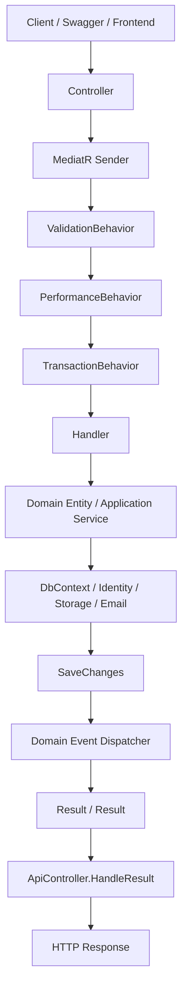
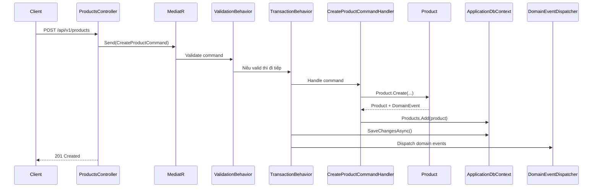

# OSM API - Project README

Tài liệu này giúp người mới hiểu nhanh source code OSM, biết cách chạy project, cấu hình database, đăng nhập JWT, phân quyền menu/chức năng và thêm một chức năng mới theo đúng flow hiện tại.

> Project hiện tại là **ASP.NET Core Web API .NET 9**, tổ chức theo hướng **Clean Architecture + CQRS/MediatR + EF Core + ASP.NET Identity + JWT + Permission-based Authorization**.

---

## 1. Mục tiêu của project

OSM API là backend mẫu có sẵn các phần nền tảng thường dùng trong hệ thống production:

- Authentication bằng **ASP.NET Identity + JWT**.
- Refresh token có hash bằng `HMACSHA256` + pepper.
- Authorization theo quyền dạng `menu.permission`, ví dụ `products.read`, `products.write`, `products.delete`.
- CRUD mẫu cho `Product`.
- Audit log khi thêm/sửa/xóa dữ liệu.
- Soft delete cho entity hỗ trợ `ISoftDelete`.
- Validation bằng FluentValidation.
- CQRS/mediator bằng MediatR.
- Transaction tự động cho command.
- Domain Event sau khi lưu dữ liệu thành công.
- API Versioning dạng `/api/v1/...`.
- Swagger có hỗ trợ nhập Bearer token.
- Serilog ghi log console/file.
- Health check cho SQL Server.
- Upload/download file lên Synology NAS.
- Đọc file Excel `.xlsx`, `.xls`.

---

## 2. Công nghệ sử dụng

| Nhóm | Công nghệ |
|---|---|
| Framework | ASP.NET Core Web API, .NET 9 |
| Database | SQL Server |
| ORM | Entity Framework Core |
| Identity | ASP.NET Core Identity |
| Authentication | JWT Bearer Token |
| Authorization | Dynamic Policy Provider + Permission Claim |
| CQRS | MediatR |
| Validation | FluentValidation |
| Logging | Serilog |
| Health check | AspNetCore.HealthChecks.SqlServer |
| Excel | ExcelDataReader |
| Email | MailKit / MimeKit |
| File Storage | Synology File Station API |

---

## 3. Cấu trúc solution

```text
OSM.sln
Directory.Build.props
src/
├── OSM.API/
│   ├── Controllers/
│   ├── Extensions/
│   ├── Middleware/
│   ├── Options/
│   ├── Program.cs
│   └── appsettings.json
│
├── OSM.Application/
│   ├── Abstractions/
│   ├── Behaviors/
│   ├── Common/
│   ├── Features/
│   │   ├── Auth/
│   │   └── Products/
│   └── DependencyInjection.cs
│
├── OSM.Domain/
│   ├── Common/
│   ├── Entities/
│   └── Exceptions/
│
└── OSM.Infrastructure/
    ├── Authentication/
    ├── Authorization/
    ├── Caching/
    ├── Data/
    ├── DomainEvents/
    ├── Emails/
    ├── Excel/
    ├── Identity/
    ├── Migrations/
    ├── Persistence/
    ├── Storage/
    └── DependencyInjection.cs
```

---

## 4. Vai trò từng project

### 4.1. `OSM.Domain`

Chứa business model cốt lõi, không phụ thuộc database, web API hay thư viện hạ tầng.

Các thành phần chính:

```text
OSM.Domain
├── Common
│   ├── Entity.cs
│   ├── IDomainEvent.cs
│   ├── IHasDomainEvents.cs
│   ├── IAuditableEntity.cs
│   └── ISoftDelete.cs
├── Entities
│   └── Products
│       ├── Product.cs
│       └── ProductCreatedDomainEvent.cs
└── Exceptions
```

Ví dụ `Product` đang chứa logic nghiệp vụ:

- `Create(...)`: tạo product mới, validate dữ liệu đầu vào và raise domain event.
- `Update(...)`: cập nhật product.
- `Delete()`: soft delete product.
- `Activate()` / `Deactivate()`: bật/tắt trạng thái.

Nguyên tắc:

- Logic nghiệp vụ nên đặt trong Domain Entity.
- Không inject service vào Domain Entity.
- Không gọi EF Core, HttpContext, Email, File, Redis trong Domain.

---

### 4.2. `OSM.Application`

Chứa use case của hệ thống. Đây là nơi viết command/query/handler/validator.

Các thành phần chính:

```text
OSM.Application
├── Abstractions
│   ├── Authentication
│   ├── Caching
│   ├── Data
│   ├── Excel
│   ├── Identity
│   ├── Messaging
│   └── Storage
├── Behaviors
│   ├── ValidationBehavior.cs
│   ├── PerformanceBehavior.cs
│   ├── TransactionBehavior.cs
│   └── TracingPipelineBehavior.cs
├── Common
│   ├── Result.cs
│   ├── PagedResult.cs
│   └── Errors
└── Features
    ├── Auth
    └── Products
```

Application chỉ biết interface, không biết class triển khai cụ thể.

Ví dụ:

- Biết `IApplicationDbContext`, không biết `ApplicationDbContext` chi tiết.
- Biết `IIdentityService`, không biết ASP.NET Identity chi tiết.
- Biết `IFileStorageService`, không biết Synology chi tiết.
- Biết `IExcelReaderService`, không biết ExcelDataReader chi tiết.

---

### 4.3. `OSM.Infrastructure`

Chứa code kỹ thuật/hạ tầng:

- EF Core DbContext.
- Migration.
- Identity user/role/permission.
- JWT token service.
- Dynamic authorization policy.
- Email sender.
- Excel reader.
- Synology file storage.
- Memory cache.
- Audit interceptor.
- SQL connection factory.

Các thành phần chính:

```text
OSM.Infrastructure
├── Authentication
├── Authorization
├── Caching
├── Data
├── DomainEvents
├── Emails
├── Excel
├── Identity
├── Migrations
├── Persistence
│   ├── Configurations
│   ├── Interceptors
│   └── Seed
└── Storage
    └── Synology
```

---

### 4.4. `OSM.API`

Là tầng ngoài cùng, nhận HTTP request và trả HTTP response.

Các thành phần chính:

```text
OSM.API
├── Controllers
│   ├── ApiController.cs
│   ├── AuthController.cs
│   ├── ProductsController.cs
│   ├── FilesController.cs
│   └── ExcelImportsController.cs
├── Extensions
├── Middleware
├── Options
├── Program.cs
└── appsettings.json
```

Controller hiện tại không xử lý business logic trực tiếp. Controller chủ yếu:

1. Nhận request.
2. Gửi command/query qua MediatR.
3. Convert `Result` thành HTTP response.

---

## 5. Luồng xử lý request



Ý nghĩa:

- Nếu request sai dữ liệu, `ValidationBehavior` trả lỗi 400.
- Nếu request là `Command`, `TransactionBehavior` tự mở transaction và `SaveChanges`.
- Nếu command thất bại, transaction rollback.
- Nếu command thành công, lưu DB, commit transaction, sau đó mới dispatch domain event.
- Controller nhận `Result` và chuyển thành response chuẩn.

---

## 6. Flow thêm/sửa/xóa Product

Ví dụ tạo Product:



---

## 7. Các endpoint chính

Base route đang dùng:

```text
/api/v{version}/[controller]
```

Với version hiện tại là `v1`.

### 7.1. Auth

| Method | Endpoint | Mô tả | Auth |
|---|---|---|---|
| POST | `/api/v1/auth/register` | Đăng ký user mới | Không bắt buộc trong code hiện tại |
| POST | `/api/v1/auth/login` | Đăng nhập, lấy access token và refresh token | AllowAnonymous |
| POST | `/api/v1/auth/refresh-token` | Đổi refresh token lấy token mới | AllowAnonymous |
| GET | `/api/v1/auth/me` | Lấy thông tin user hiện tại, role, menu, permission | Bearer token |

### 7.2. Products

| Method | Endpoint | Mô tả | Policy |
|---|---|---|---|
| GET | `/api/v1/products` | Danh sách product, hỗ trợ search/paging | Hiện đang mở trong code |
| GET | `/api/v1/products/{id}` | Chi tiết product | `products.read` |
| POST | `/api/v1/products` | Tạo product | `products.write` |
| PUT | `/api/v1/products/{id}` | Cập nhật product | `products.write` |
| DELETE | `/api/v1/products/{id}` | Xóa mềm product | `products.delete` |

### 7.3. Files

| Method | Endpoint | Mô tả | Auth |
|---|---|---|---|
| POST | `/api/v1/files/folders` | Tạo folder trên Synology | Bearer token |
| POST | `/api/v1/files/upload` | Upload file lên Synology | Bearer token |
| GET | `/api/v1/files/download?path=...` | Download file từ Synology | Bearer token |

### 7.4. Excel Import

| Method | Endpoint | Mô tả | Auth |
|---|---|---|---|
| POST | `/api/v1/excelimports/preview` | Upload file Excel và preview dữ liệu | Bearer token |

File Excel hiện hỗ trợ:

```text
.xlsx
.xls
```

Controller preview hiện đang yêu cầu các cột mẫu:

```text
Code
Name
StockQuantity
```

### 7.5. Health Check

| Endpoint | Mô tả |
|---|---|
| `/health` | Check tổng quát |
| `/health/ready` | Check app sẵn sàng, gồm SQL Server |
| `/health/live` | Check process còn sống |

### 7.6. Swagger

```text
/swagger
```

Swagger đã cấu hình Bearer JWT. Sau khi login, copy `accessToken`, bấm **Authorize**, nhập:

```text
Bearer <accessToken>
```

---

## 8. Cách chạy project trên máy local

### 8.1. Yêu cầu môi trường

Cài các công cụ sau:

- Visual Studio 2022 bản mới hoặc Visual Studio Code.
- .NET 9 SDK.
- SQL Server hoặc SQL Server Express.
- SQL Server Management Studio nếu cần quản lý DB.
- Git.

Kiểm tra .NET SDK:

```bash
dotnet --info
```

---

### 8.2. Restore và build

Tại thư mục chứa `OSM.sln`:

```bash
dotnet restore
```

```bash
dotnet build
```

---

### 8.3. Cấu hình `appsettings.json`

File cấu hình chính:

```text
src/OSM.API/appsettings.json
```

Các section quan trọng:

```json
{
  "ConnectionStrings": {
    "DefaultConnection": "Server=YOUR_SERVER;Database=OSM_DB;User Id=YOUR_USER;Password=YOUR_PASSWORD;TrustServerCertificate=True;MultipleActiveResultSets=true"
  },
  "Jwt": {
    "Issuer": "OSM_Server",
    "Audience": "OSM_Client",
    "SecretKey": "CHANGE_THIS_TO_A_LONG_RANDOM_SECRET_AT_LEAST_32_CHARS",
    "ExpirationMinutes": 60,
    "RefreshTokenExpirationDays": 7
  },
  "TokenHashing": {
    "Pepper": "CHANGE_THIS_TO_A_LONG_RANDOM_PEPPER_AT_LEAST_32_CHARS"
  },
  "EmailConfiguration": {
    "From": "noreply@your-company.com",
    "SmtpServer": "smtp.your-company.com",
    "Port": 25,
    "UserName": "",
    "Password": ""
  },
  "Synology": {
    "BaseUrl": "http://YOUR_NAS:5000/webapi/",
    "Account": "YOUR_ACCOUNT",
    "Password": "YOUR_PASSWORD",
    "Session": "FileStation",
    "AuthVersion": 3,
    "FileStationVersion": 2
  },
  "FileUpload": {
    "MaxFileSizeMb": 50,
    "AllowedExtensions": [ ".xlsx", ".xls" ]
  },
  "IdentitySeed": {
    "Enabled": true,
    "AdminUserName": "admin",
    "AdminEmail": "admin@gmail.com",
    "AdminPassword": "Admin123"
  }
}
```

> Không nên commit connection string, JWT secret, token pepper, email password, Synology password thật lên Git. Nên dùng **User Secrets**, biến môi trường hoặc secret manager của server.

Ví dụ dùng User Secrets cho local:

```bash
cd src/OSM.API

dotnet user-secrets init

dotnet user-secrets set "ConnectionStrings:DefaultConnection" "Server=.;Database=OSM_DB;Trusted_Connection=True;TrustServerCertificate=True"
dotnet user-secrets set "Jwt:SecretKey" "YOUR_LOCAL_LONG_RANDOM_SECRET_KEY_123456789"
dotnet user-secrets set "TokenHashing:Pepper" "YOUR_LOCAL_LONG_RANDOM_PEPPER_123456789"
```

---

### 8.4. Tạo database bằng migration

Cài EF Core CLI nếu chưa có:

```bash
dotnet tool install --global dotnet-ef
```

Update database:

```bash
dotnet ef database update \
  --project src/OSM.Infrastructure \
  --startup-project src/OSM.API
```

Nếu cần tạo migration mới:

```bash
dotnet ef migrations add YourMigrationName \
  --project src/OSM.Infrastructure \
  --startup-project src/OSM.API \
  --output-dir Migrations
```

Nếu dùng Visual Studio Package Manager Console:

```powershell
Update-Database -Project OSM.Infrastructure -StartupProject OSM.API
```

---

### 8.5. Seed dữ liệu ban đầu

Seed được gọi trong `Program.cs` khi môi trường là Development:

```csharp
if (app.Environment.IsDevelopment())
{
    app.UseAppSwagger();
    await app.SeedIdentity();
}
```

Để bật seed, cấu hình:

```json
"IdentitySeed": {
  "Enabled": true,
  "AdminUserName": "admin",
  "AdminEmail": "admin@gmail.com",
  "AdminPassword": "Admin123"
}
```

Seed hiện tạo:

- Role: `Admin`, `User`.
- Menu mẫu.
- Permission: `read`, `write`, `delete`.
- Gán quyền cho role.
- Tạo user admin.

Sau khi seed xong, nên đổi:

```json
"Enabled": false
```

để tránh seed lại ngoài ý muốn.

---

### 8.6. Chạy API

```bash
dotnet run --project src/OSM.API
```

Sau đó mở:

```text
https://localhost:<port>/swagger
```

Port cụ thể xem trong:

```text
src/OSM.API/Properties/launchSettings.json
```

---

## 9. Authentication và JWT

### 9.1. Login

Gửi request:

```http
POST /api/v1/auth/login
Content-Type: application/json
```

Body mẫu:

```json
{
  "userNameOrEmail": "admin",
  "password": "Admin123"
}
```

Response thành công trả về dạng:

```json
{
  "accessToken": "...",
  "refreshToken": "...",
  "expiresAt": "2026-01-01T00:00:00Z"
}
```

### 9.2. Dùng token gọi API cần đăng nhập

Header:

```http
Authorization: Bearer <accessToken>
```

### 9.3. Refresh token

```http
POST /api/v1/auth/refresh-token
Content-Type: application/json
```

Body:

```json
{
  "refreshToken": "<refreshToken>"
}
```

Refresh token không lưu plain text trong DB. Project hash refresh token bằng:

```text
HMACSHA256(refreshToken, TokenHashing:Pepper)
```

---

## 10. Authorization và hiển thị menu theo quyền

Project đang dùng permission-based authorization.

Policy có dạng:

```text
{menuId}.{permissionId}
```

Ví dụ:

```text
products.read
products.write
products.delete
```

Trong controller:

```csharp
[Authorize(Policy = Policies.ProductRead)]
```

hoặc dùng trực tiếp:

```csharp
[Authorize(Policy = "products.delete")]
```

### 10.1. Vì sao không cần khai báo từng policy trong `AddAuthorization`?

Project đã có:

```csharp
services.AddAuthorization();
services.AddSingleton<IAuthorizationPolicyProvider, PermissionAuthorizationPolicyProvider>();
services.AddSingleton<IAuthorizationHandler, PermissionAuthorizationHandler>();
```

`PermissionAuthorizationPolicyProvider` tự tạo policy động nếu policy có dạng:

```text
xxx.yyy
```

Ví dụ khi controller dùng:

```csharp
[Authorize(Policy = "products.delete")]
```

ASP.NET sẽ hỏi policy provider. Nếu policy chưa tồn tại, provider tự tạo policy yêu cầu claim:

```text
permission = products.delete
```

### 10.2. Claim permission được tạo ở đâu?

Trong `JwtTokenService.CreateAccessToken(...)`:

```csharp
claims.AddRange(permissions.Select(permission => new Claim("permission", permission)));
```

Các permission được lấy từ DB thông qua bảng:

```text
RoleMenuPermission
```

### 10.3. Frontend hiển thị menu như thế nào?

Gọi API:

```http
GET /api/v1/auth/me
Authorization: Bearer <accessToken>
```

Response có thể chứa:

- UserId.
- UserName.
- Roles.
- Permissions.
- Menus.

Frontend dùng `menus` để render menu, dùng `permissionKeys` để ẩn/hiện nút:

Ví dụ:

```text
products.read    => được xem màn hình sản phẩm
products.write   => được thêm/sửa sản phẩm
products.delete  => được xóa sản phẩm
```

---

## 11. Cơ chế lỗi chuẩn

Project dùng `Result` và `ErrorType` để map lỗi về HTTP status.

| ErrorType | HTTP Status | Ý nghĩa |
|---|---:|---|
| Validation | 400 | Dữ liệu không hợp lệ |
| Unauthorized | 401 | Chưa đăng nhập hoặc token sai/hết hạn |
| Forbidden | 403 | Đã đăng nhập nhưng thiếu quyền |
| NotFound | 404 | Không tìm thấy dữ liệu |
| Conflict | 409 | Trùng dữ liệu hoặc xung đột |
| Unexpected | 500 | Lỗi không mong muốn |

`ApiController.HandleResult(...)` sẽ convert `Result` thành `ProblemDetails`.

Riêng lỗi JWT được xử lý trước khi vào controller:

- `OnChallenge` trả 401.
- `OnForbidden` trả 403.

Phần này nằm trong:

```text
src/OSM.Infrastructure/DependencyInjection.cs
```

---

## 12. MediatR Pipeline Behaviors

Các behavior được đăng ký trong:

```text
src/OSM.Application/DependencyInjection.cs
```

```csharp
services.AddTransient(typeof(IPipelineBehavior<,>), typeof(ValidationBehavior<,>));
services.AddTransient(typeof(IPipelineBehavior<,>), typeof(PerformanceBehavior<,>));
services.AddTransient(typeof(IPipelineBehavior<,>), typeof(TransactionBehavior<,>));
services.AddTransient(typeof(IPipelineBehavior<,>), typeof(TracingPipelineBehavior<,>));
```

### 12.1. `ValidationBehavior`

Tự chạy FluentValidation trước handler.

Nếu lỗi, không vào handler và trả `Result.Failure(...)`.

### 12.2. `PerformanceBehavior`

Đo thời gian xử lý request. Nếu lâu hơn 5 giây thì ghi warning log.

### 12.3. `TransactionBehavior`

Chỉ áp dụng cho `ICommand` hoặc `ICommand<T>`.

Nhiệm vụ:

1. Mở transaction.
2. Chạy handler.
3. Nếu handler trả failure thì rollback.
4. Nếu thành công thì `SaveChangesAsync`.
5. Commit transaction.
6. Dispatch domain events.

### 12.4. `TracingPipelineBehavior`

Ghi log request và thời gian xử lý.

---

## 13. Audit log

Audit được xử lý bằng EF Core interceptor:

```text
src/OSM.Infrastructure/Persistence/Interceptors/AuditSaveChangesInterceptor.cs
```

Interceptor tự động:

- Set `CreatedAt`, `CreatedBy` khi thêm mới entity có `IAuditableEntity`.
- Set `ModifiedAt`, `ModifiedBy` khi sửa entity có `IAuditableEntity`.
- Set `DeletedAt`, `DeletedBy` khi soft delete entity có `ISoftDelete`.
- Ghi bảng `AuditLogs` gồm table name, action, key, old values, new values, changed columns.

Các field nhạy cảm đang được bỏ qua:

```text
PasswordHash
SecurityStamp
ConcurrencyStamp
TokenHash
AuthenticatorKey
RecoveryCodes
```

---

## 14. Domain Event

Entity có thể raise domain event.

Ví dụ trong `Product.Create(...)`:

```csharp
product.RaiseDomainEvent(new ProductCreatedDomainEvent(product.Id));
```

Sau khi command lưu DB thành công, `TransactionBehavior` dispatch domain event qua:

```text
IDomainEventDispatcher
```

Implementation hiện tại:

```text
src/OSM.Infrastructure/DomainEvents/MediatRDomainEventDispatcher.cs
```

Handler mẫu:

```text
src/OSM.Application/Features/Products/Events/ProductCreatedDomainEventHandler.cs
```

Domain event phù hợp cho các việc phụ sau khi nghiệp vụ chính đã thành công:

- Gửi email thông báo.
- Xóa/cache lại dữ liệu.
- Ghi log nghiệp vụ.
- Đồng bộ sang hệ thống khác.

---

## 15. Excel Import

Interface:

```text
src/OSM.Application/Abstractions/Excel/IExcelReaderService.cs
```

Implementation:

```text
src/OSM.Infrastructure/Excel/ExcelDataReaderService.cs
```

Controller mẫu:

```text
src/OSM.API/Controllers/ExcelImportsController.cs
```

Ví dụ đọc file:

```csharp
var result = await _excelReaderService.ReadAsync(
    stream,
    file.FileName,
    new ExcelReadOptions
    {
        HeaderRowNumber = 1,
        StartDataRowNumber = 2,
        MaxRows = 5_000,
        StopWhenFirstColumnEmpty = true,
        RequiredColumns =
        [
            "Code",
            "Name",
            "StockQuantity"
        ]
    },
    cancellationToken);
```

Kết quả trả về:

- `SheetName`.
- `Rows`.
- `Errors`.
- `IsSuccess`.

Khi thêm chức năng import thật, nên làm theo flow:

```text
Controller upload Excel
→ IExcelReaderService đọc dữ liệu
→ Validate từng dòng
→ Send Command qua MediatR
→ Handler lưu DB
→ Trả kết quả dòng thành công/lỗi
```

---

## 16. File upload Synology

Interface:

```text
src/OSM.Application/Abstractions/Storage/IFileStorageService.cs
```

Implementation:

```text
src/OSM.Infrastructure/Storage/Synology/SynologyFileStorageService.cs
```

Controller:

```text
src/OSM.API/Controllers/FilesController.cs
```

Cấu hình:

```json
"Synology": {
  "BaseUrl": "http://YOUR_NAS:5000/webapi/",
  "Account": "YOUR_ACCOUNT",
  "Password": "YOUR_PASSWORD",
  "Session": "FileStation",
  "AuthVersion": 3,
  "FileStationVersion": 2
}
```

Giới hạn upload:

```json
"FileUpload": {
  "MaxFileSizeMb": 50,
  "AllowedExtensions": [ ".xlsx", ".xls" ]
}
```

---

## 17. Logging bằng Serilog

Cấu hình ở:

```text
src/OSM.API/appsettings.json
```

Log file mặc định ghi vào:

```text
src/OSM.API/logs/log-yyyyMMdd.txt
```

Nên kiểm tra log khi gặp lỗi:

- Middleware exception.
- Request chậm.
- Lỗi gửi email.
- Lỗi Synology.
- Lỗi SQL.

---

## 18. Health check

Cấu hình ở:

```text
src/OSM.API/Extensions/HealthCheckExtensions.cs
```

Health check SQL Server dùng connection string `DefaultConnection`.

Khi deploy IIS, có thể dùng `/health/live` hoặc `/health/ready` để kiểm tra app còn sống không.

---

## 19. Cách thêm một chức năng mới

Ví dụ thêm chức năng `Supplier`.

### Bước 1: Tạo entity trong Domain

Tạo file:

```text
src/OSM.Domain/Entities/Suppliers/Supplier.cs
```

Ví dụ:

```csharp
using OSM.Domain.Common;

namespace OSM.Domain.Entities.Suppliers;

public sealed class Supplier : Entity<Guid>, IAuditableEntity, ISoftDelete
{
    private Supplier() { }

    private Supplier(string name, string code)
    {
        Id = Guid.NewGuid();
        Name = name.Trim();
        Code = code.Trim().ToUpperInvariant();
        IsActive = true;
    }

    public string Name { get; private set; } = string.Empty;
    public string Code { get; private set; } = string.Empty;
    public bool IsActive { get; private set; }

    public DateTimeOffset CreatedAt { get; set; }
    public string? CreatedBy { get; set; }
    public DateTimeOffset? ModifiedAt { get; set; }
    public string? ModifiedBy { get; set; }
    public bool IsDeleted { get; set; }
    public DateTimeOffset? DeletedAt { get; set; }
    public string? DeletedBy { get; set; }

    public static Supplier Create(string name, string code)
    {
        if (string.IsNullOrWhiteSpace(name))
            throw new ArgumentException("Supplier name is required.", nameof(name));

        if (string.IsNullOrWhiteSpace(code))
            throw new ArgumentException("Supplier code is required.", nameof(code));

        return new Supplier(name, code);
    }

    public void Update(string name, bool isActive)
    {
        if (string.IsNullOrWhiteSpace(name))
            throw new ArgumentException("Supplier name is required.", nameof(name));

        Name = name.Trim();
        IsActive = isActive;
    }

    public void Delete()
    {
        IsDeleted = true;
        IsActive = false;
    }
}
```

### Bước 2: Thêm DbSet vào `IApplicationDbContext`

File:

```text
src/OSM.Application/Abstractions/Data/IApplicationDbContext.cs
```

Thêm:

```csharp
DbSet<Supplier> Suppliers { get; }
```

Nếu interface chưa expose `Database`, `GetDomainEvents`, `ClearDomainEvents`, cần đảm bảo các member đang dùng bởi `TransactionBehavior` có trong interface.

### Bước 3: Thêm DbSet vào `ApplicationDbContext`

File:

```text
src/OSM.Infrastructure/Persistence/ApplicationDbContext.cs
```

Thêm:

```csharp
public DbSet<Supplier> Suppliers => Set<Supplier>();
```

### Bước 4: Tạo EF configuration

Tạo file:

```text
src/OSM.Infrastructure/Persistence/Configurations/SupplierConfiguration.cs
```

Ví dụ:

```csharp
using Microsoft.EntityFrameworkCore;
using Microsoft.EntityFrameworkCore.Metadata.Builders;
using OSM.Domain.Entities.Suppliers;

namespace OSM.Infrastructure.Persistence.Configurations;

public sealed class SupplierConfiguration : IEntityTypeConfiguration<Supplier>
{
    public void Configure(EntityTypeBuilder<Supplier> builder)
    {
        builder.ToTable("Suppliers");
        builder.HasKey(x => x.Id);

        builder.Property(x => x.Name)
            .HasMaxLength(200)
            .IsRequired();

        builder.Property(x => x.Code)
            .HasMaxLength(50)
            .IsRequired();

        builder.HasIndex(x => x.Code)
            .IsUnique();

        builder.HasQueryFilter(x => !x.IsDeleted);
    }
}
```

### Bước 5: Tạo Feature trong Application

Tạo folder:

```text
src/OSM.Application/Features/Suppliers
```

Nên chia theo use case:

```text
Features/Suppliers/
├── SupplierResponse.cs
├── CreateSupplier/
│   ├── CreateSupplierCommand.cs
│   ├── CreateSupplierCommandHandler.cs
│   └── CreateSupplierCommandValidator.cs
├── GetSuppliers/
│   ├── GetSuppliersQuery.cs
│   └── GetSuppliersQueryHandler.cs
├── GetSupplierById/
├── UpdateSupplier/
└── DeleteSupplier/
```

### Bước 6: Tạo Command

```csharp
using OSM.Application.Abstractions.Messaging;

namespace OSM.Application.Features.Suppliers.CreateSupplier;

public sealed record CreateSupplierCommand(
    string Name,
    string Code) : ICommand<Guid>;
```

### Bước 7: Tạo Validator

```csharp
using FluentValidation;

namespace OSM.Application.Features.Suppliers.CreateSupplier;

public sealed class CreateSupplierCommandValidator : AbstractValidator<CreateSupplierCommand>
{
    public CreateSupplierCommandValidator()
    {
        RuleFor(x => x.Name)
            .NotEmpty()
            .MaximumLength(200);

        RuleFor(x => x.Code)
            .NotEmpty()
            .MaximumLength(50);
    }
}
```

### Bước 8: Tạo Handler

```csharp
using MediatR;
using Microsoft.EntityFrameworkCore;
using OSM.Application.Abstractions.Data;
using OSM.Application.Common;
using OSM.Application.Common.Errors;
using OSM.Domain.Entities.Suppliers;

namespace OSM.Application.Features.Suppliers.CreateSupplier;

public sealed class CreateSupplierCommandHandler(IApplicationDbContext dbContext)
    : IRequestHandler<CreateSupplierCommand, Result<Guid>>
{
    public async Task<Result<Guid>> Handle(
        CreateSupplierCommand request,
        CancellationToken cancellationToken)
    {
        var code = request.Code.Trim().ToUpperInvariant();

        var exists = await dbContext.Suppliers
            .AnyAsync(x => x.Code == code, cancellationToken);

        if (exists)
        {
            return Result.Failure<Guid>(Error.Conflict(
                "Suppliers.CodeDuplicated",
                "Supplier code already exists."));
        }

        var supplier = Supplier.Create(request.Name, request.Code);

        dbContext.Suppliers.Add(supplier);

        return Result.Success(supplier.Id);
    }
}
```

Không cần gọi `SaveChangesAsync()` trong command handler nếu command đi qua `TransactionBehavior`. Behavior sẽ tự save.

### Bước 9: Tạo Controller

Tạo file:

```text
src/OSM.API/Controllers/SuppliersController.cs
```

Ví dụ:

```csharp
using Asp.Versioning;
using MediatR;
using Microsoft.AspNetCore.Authorization;
using Microsoft.AspNetCore.Mvc;
using OSM.Application.Features.Suppliers.CreateSupplier;

namespace OSM.API.Controllers;

[ApiVersion("1.0")]
public sealed class SuppliersController(ISender sender) : ApiController
{
    [HttpPost]
    [Authorize(Policy = "suppliers.write")]
    public async Task<IActionResult> CreateSupplier(
        CreateSupplierCommand command,
        CancellationToken cancellationToken)
    {
        var result = await sender.Send(command, cancellationToken);

        return result.IsSuccess
            ? Created($"/api/v1/suppliers/{result.Value}", result.Value)
            : HandleResult(result);
    }
}
```

### Bước 10: Thêm permission/menu trong DB

Cần có dữ liệu:

```text
Menus:
MenuId = suppliers

Permissions:
read
write
delete

RoleMenuPermission:
RoleId = Admin
MenuId = suppliers
PermissionId = read/write/delete
```

Sau đó khi user login, JWT sẽ có claim:

```text
permission = suppliers.write
```

Khi đó endpoint:

```csharp
[Authorize(Policy = "suppliers.write")]
```

sẽ hoạt động.

### Bước 11: Tạo migration và update DB

```bash
dotnet ef migrations add AddSuppliers \
  --project src/OSM.Infrastructure \
  --startup-project src/OSM.API \
  --output-dir Migrations
```

```bash
dotnet ef database update \
  --project src/OSM.Infrastructure \
  --startup-project src/OSM.API
```

---

## 20. Checklist khi thêm feature mới

Khi tạo một module mới, nên đi theo checklist này:

```text
[ ] Tạo Domain Entity
[ ] Thêm DbSet vào IApplicationDbContext
[ ] Thêm DbSet vào ApplicationDbContext
[ ] Tạo EF Configuration
[ ] Tạo Response DTO
[ ] Tạo Command/Query
[ ] Tạo Validator
[ ] Tạo Handler
[ ] Tạo Controller
[ ] Thêm policy/permission/menu nếu endpoint cần phân quyền
[ ] Tạo migration
[ ] Update database
[ ] Test bằng Swagger/Postman
[ ] Kiểm tra audit log
[ ] Kiểm tra Serilog log nếu lỗi
```

---

## 21. Những file/folder không nên commit

Trong source zip hiện có một số folder/file sinh tự động từ Visual Studio/build. Không nên commit các file này lên Git:

```text
.vs/
**/bin/
**/obj/
**/*.user
**/logs/
```

Nên có `.gitignore` tối thiểu:

```gitignore
.vs/
**/bin/
**/obj/
**/*.user
**/logs/
*.suo
*.user
*.rsuser
```

Ngoài ra không nên commit secret thật trong:

```text
appsettings.json
appsettings.Production.json
```

Nên để cấu hình nhạy cảm ở:

- User Secrets cho local.
- Environment variables trên server.
- Secret manager nếu deploy cloud.

---

## 22. Lưu ý production

Trước khi deploy production, cần kiểm tra:

```text
[ ] Đổi Jwt:SecretKey sang chuỗi mạnh, không dùng key demo
[ ] Đổi TokenHashing:Pepper sang chuỗi mạnh
[ ] Không để password DB/email/NAS trong Git
[ ] Tắt IdentitySeed hoặc chỉ seed có kiểm soát
[ ] Bật HTTPS
[ ] Cấu hình CORS nếu frontend khác domain
[ ] Kiểm tra Serilog rolling file và dung lượng log
[ ] Kiểm tra health check /health/ready
[ ] Kiểm tra migration đã chạy trên DB production
[ ] Kiểm tra quyền SQL user chỉ đủ quyền cần thiết
[ ] Kiểm tra endpoint nào cần Authorize nhưng đang mở
[ ] Kiểm tra backup database
```

Endpoint đang cần chú ý:

```text
GET /api/v1/products
```

Trong code hiện tại dòng `[Authorize(Policy = Policies.Read)]` đang bị comment. Nếu production cần bảo vệ danh sách product, nên bật lại policy phù hợp, ví dụ:

```csharp
[Authorize(Policy = Policies.ProductRead)]
```

---

## 23. Troubleshooting thường gặp

### 23.1. Lỗi 401 Unauthorized

Nguyên nhân thường gặp:

- Không gửi header `Authorization`.
- Sai format Bearer token.
- Token hết hạn.
- `Jwt:Issuer`, `Jwt:Audience`, `Jwt:SecretKey` không khớp.

Header đúng:

```http
Authorization: Bearer <accessToken>
```

---

### 23.2. Lỗi 403 Forbidden

Nguyên nhân:

- Đã đăng nhập nhưng JWT không có claim permission cần thiết.
- User chưa được gán role đúng.
- Role chưa có dữ liệu trong `RoleMenuPermission`.

Ví dụ endpoint yêu cầu:

```csharp
[Authorize(Policy = "products.delete")]
```

JWT phải có claim:

```text
permission = products.delete
```

---

### 23.3. Lỗi validate option khi start app

Project dùng `ValidateOnStart()` cho nhiều config:

- `EmailConfiguration`.
- `Jwt`.
- `TokenHashing`.
- `Synology`.
- `FileUpload`.

Nếu thiếu cấu hình, app có thể lỗi ngay khi khởi động. Kiểm tra `appsettings.json`, User Secrets hoặc environment variables.

---

### 23.4. Lỗi database connection

Kiểm tra:

- SQL Server có chạy không.
- Connection string đúng server/database/user/password không.
- Firewall có mở port SQL không.
- `TrustServerCertificate=True` nếu dùng local/self-signed certificate.
- User SQL có quyền tạo/sửa DB nếu chạy migration không.

---

### 23.5. Lỗi migration không tìm thấy appsettings

Nếu chạy EF command từ sai folder, design-time DbContext có thể không đọc được `appsettings.json`.

Nên chạy bằng cú pháp có `--startup-project`:

```bash
dotnet ef database update \
  --project src/OSM.Infrastructure \
  --startup-project src/OSM.API
```

---

### 23.6. Lỗi Synology upload/download

Kiểm tra:

- `Synology:BaseUrl` đúng chưa.
- Account/password đúng chưa.
- NAS có bật File Station API chưa.
- Máy API có ping/telnet được NAS không.
- Folder path trên NAS có tồn tại không.
- User NAS có quyền đọc/ghi folder không.

---

## 24. Quy ước coding nên giữ

Nên giữ các quy ước sau để code dễ maintain:

```text
Domain
- Chứa nghiệp vụ cốt lõi
- Không phụ thuộc Infrastructure/API

Application
- Chứa use case
- Handler trả Result/Result<T>
- Command thay đổi dữ liệu
- Query chỉ đọc dữ liệu
- Validator dùng FluentValidation

Infrastructure
- Chứa EF Core, Identity, JWT, Email, File Storage, Excel, Cache
- Implement interface từ Application

API
- Controller mỏng
- Không viết business logic trong controller
- Trả response thông qua HandleResult
```

---

## 25. Đường đi nhanh cho người mới

Nếu mới vào project, nên đọc theo thứ tự này:

1. `src/OSM.API/Program.cs` để hiểu app đăng ký service và middleware như nào.
2. `src/OSM.API/Controllers/ProductsController.cs` để hiểu controller gọi MediatR.
3. `src/OSM.Application/Features/Products/CreateProduct` để hiểu command/handler/validator.
4. `src/OSM.Domain/Entities/Products/Product.cs` để hiểu entity nghiệp vụ.
5. `src/OSM.Infrastructure/Persistence/ApplicationDbContext.cs` để hiểu DbContext.
6. `src/OSM.Infrastructure/Persistence/Configurations/ProductConfiguration.cs` để hiểu mapping database.
7. `src/OSM.Application/Behaviors/TransactionBehavior.cs` để hiểu vì sao handler không cần gọi `SaveChanges`.
8. `src/OSM.Infrastructure/Authorization` để hiểu phân quyền động.
9. `src/OSM.Infrastructure/Identity/IdentityService.cs` để hiểu login, refresh token, lấy menu/permission.
10. `src/OSM.Infrastructure/Persistence/Interceptors/AuditSaveChangesInterceptor.cs` để hiểu audit log.

---

## 26. Tóm tắt kiến trúc một câu

Project này dùng **API làm cổng vào**, **Application chứa use case**, **Domain chứa nghiệp vụ**, **Infrastructure chứa kỹ thuật**, mọi request đi qua **MediatR pipeline** để validate, log, transaction, audit và phân quyền theo JWT permission.
